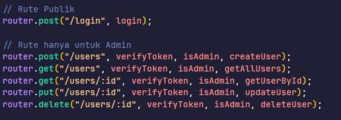

# User & Authentication Service 🔑



Service ini merupakan bagian dari arsitektur **microservices** untuk aplikasi **Absensi WFH**.  
Fungsinya untuk:

- Mengelola data user (karyawan & admin)
- Menangani proses otentikasi (login) menggunakan JWT

---

## 🚀 Teknologi yang Digunakan

- **Node.js** – Runtime JavaScript
- **Express.js** – Framework untuk REST API
- **Prisma** – ORM untuk interaksi database
- **MySQL** – Database relasional
- **JWT** – Autentikasi berbasis token
- **Bcrypt.js** – Untuk hashing password

---

## ⚙️ Cara Install & Jalankan

### 1. Clone Repository

```bash
git clone https://github.com/ihsanmarseno/user-service.git
cd /user-service
```

### 2. Install Dependencies

```bash
npm install
```

### 3. Setup Environment Variables

```bash
DATABASE_URL="mysql://root:@localhost:3306/auth-service"
JWT_SECRET="JWTSECRETDUMMY"
PORT=5001
```

### 4. Running Migrasi Prisma

```bash
npx prisma migrate dev
```

### 5. Generate Prisma Client

```bash
npx prisma generate
```

### 6. Running Server

- Mode Development

```bash
npm run dev
```

- Mode Production

```bash
npm run start
```
